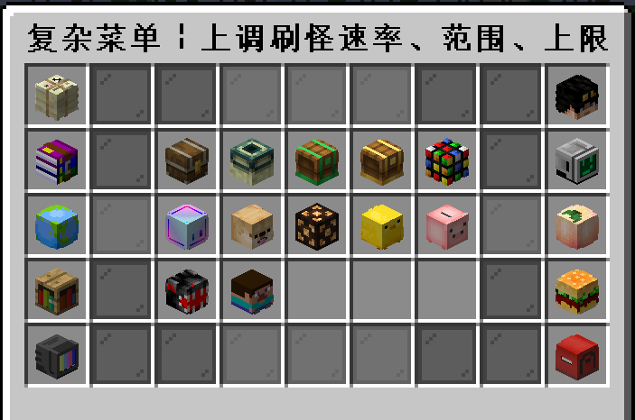

## 基础指令列表

> [!tip]
> 所有的指令在游戏按`Tab键`都可自动补全。

| 操作                         | 指令                | 示例或说明                                         |
| :--------------------------- | :------------------ | :------------------------------------------------- |
|**打开服务菜单**|`/cd`或`/menu`||
|**查看账户积蓄**|`/money`||
|**打钱给其他玩家**|`/money pay <在线玩家游戏名> <转账金额>`|执行`/money pay Dell_G3 114514`可转账114514元给Dell_G3，**注意还要点击确认，否则不会执行转账动作**|
|**创建红包**|`/redpacket add`||
|**查看公开传送点**|`/warp`||
|**使用商店**|`/shop`||
|**点歌听歌**|`/music <网易云歌曲ID或链接>`|执行`/music 5221167`可点播[著名诈骗曲](https://music.163.com/#/song?id=5221167)，客户端需安装[AllMusic](/allmusic)，并在游戏中打开音符盒音量|
|**使用表情包**|`/e` + 空格|使用上下方向键查看和选择对应表情包，按TAB键输入选中的表情包|
|**跟玩家说悄悄话**|`/msg <在线玩家游戏名> <消息内容>`|`/msg neverlag 我很可爱，请给我钱`|
| **请求传送到玩家身边**     | `/tpa <在线玩家游戏名>`     | 执行`/tpa neverlag`可向neverlag发出传送至其身边的请求                                    |
| **请求玩家传送到身边** | `/tpahere <在线玩家游戏名>` |执行`/tpahere neverlag`可请求neverlag传送到玩家身边                            |
| **随机传送**                 | `/rt`               | |
| **返回死亡的地点**           | `/back`             | 某些死亡地点会非常考验玩家的逃生手速（比如岩浆中） |
| **前往地标**                 | `/warp <地标名>`    | 可用的地标名会自动显示出来                         |
|**设置传送点**|`/warp set <传送点名称>`|传送点没有任何权限可以设置，因此不能代替圈地防熊|
| **前往领地**                 | `/res tp <领地名>`  |你需要先知道目的地的领地名称|
|**设置家**|`/sethome <家的名称>`|名称不可重复，默认为home|
| **回家**                     | `/home`             | 你需要设置过家                   |

## 复杂菜单简介

“复杂菜单”是本服基于[TrMenu](https://trmenu.docs.insinuate.cn/)开发的自定义系统菜单，可以为玩家提供许多有用（或没用）的功能。复杂菜单的打开方式有两种，一种是快捷键`shift + F`（注意不要与其他快捷键冲突），另一种是通过指令`/cd`或`/menu`。

打开后的菜单类似下图所示：

菜单两侧是非常用功能，中间则是常用功能。由于菜单功能繁多且随时可能发生变动，因此这里并不打算对每个功能都做详细介绍，玩家可以在游戏内自行探索。
