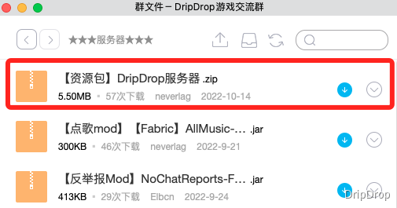

## 提前劝退

**不欢迎** 素质低下的人（shǎ）员（bī）：

+ 恶意搞破坏的`熊孩子`；
+ 具有恶劣作弊行为（飞天、透视等）的`神仙`；
+ 脾气暴躁，随时随地口吐芬芳的`祖安人`；
+ 一无所知，却认为别人应当无条件帮助自己的`爷新`。

**不适合** 以下玩家：

+ 搞大型红石的玩家；
+ 重度RPG玩家；
+ 热衷肝/刷并以此为唯一游戏目标的玩家。

## 进入服务器

目前我们还没有设置白名单的门槛，你可以通过域名 `dripdrop.games:25565` 连入我们的服务器。

使用 **1.17** 任意版本都能够加入游戏。

## 安装材质包

> 👍 你可以暂时跳过此步，因为这并不是必须的。
>
> 🍀 但是如果你想体验拓展物品，请 **务必安装** 材质包。
>
> ❓ 材质包的有关问题请查看 [入服常见问题](joinproblem.md)。

请知悉，服务器里面的拓展物品需要安装材质包，你可以在进入服务器后，选择 **是** 即可自动下载使用：

## 注册与登录

首次加入服务器，请 `按T` 打开聊天框，输入指令`/register <密码> <重复一次密码>` ，回车完成用户注册。

例如 `/register hangzhou2022 hangzhou2022`。

登录服务器，只需要输入指令 `/login <密码>` 并回车，就能完成用户登录。

例如 `/login hangzhou2022`。

## 正版验证

> ❌ 如果你并非正版玩家，请 **不要** 进行正版验证。

输入指令 `/premium` 之后再次输入指令 `/premium`。

