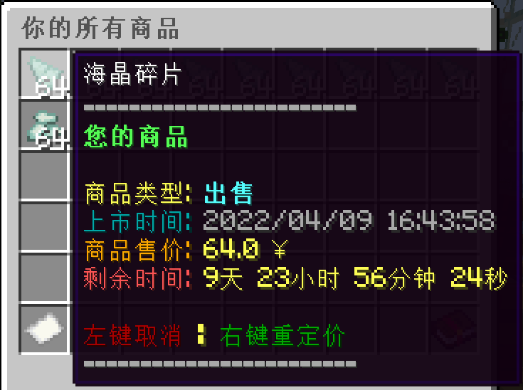

1. **也可以同其他玩家自由交易**

   玩家可以进入下图所示自由市场，自由买卖任何由玩家上架的商品：

   
   

   如果玩家有物品需要售出，首先要**右手持有该物品**，接着输入指令`/ca sell <总售价> <售出数量>`并发送执行，即可将物品上架到自由市场中。

   >[!note]
   >注意，在`/ca sell <总售价> <售出数量>`指令中，售出数量**最大不能超过玩家右手持有的物品实际数量**，总售价也是代表这些数量的物品打包出售的价格，数值不能低于0.1。此外，如果一个（组）物品没有被拿在右手上，那么出售指令是不会对其生效的。

   如果玩家想要对已上架的商品进行重新定价，那么可以按照下图进到相应的菜单界面，选择要重新定价的商品：

   
   

   **右键**点击指定商品，系统就会在聊天栏里弹出类似下图的提示，按指示修改定价即可：

   