> [!note]
> 📘 以下教程是为 **<u>没有启动器</u>** 甚至 **<u>不知道 *Java* 是什么</u>** 的 **超级萌新** 准备的

## 下载Java

对于纯新手而言，直接在QQ群 `286338133` 的群文件 `Java环境下载` 里下载 *Java* 安装包是最为简便的方式。群内提供了Oracle JRE 8和Oracle JDK 16的安装包，并且会不定时进行版本替换，如下图所示：

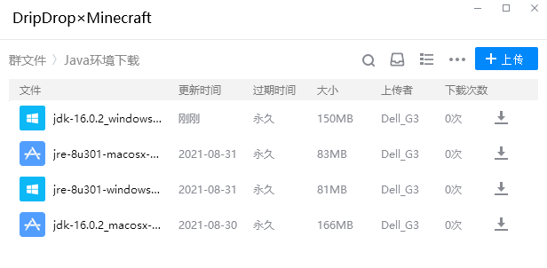

> [!tip]
> 使用**官方启动器**的玩家不需要额外下载Java，因为自1.17开始，官方启动器就已经内置了Java 16。
> 另外，我们不生产JDK或JRE，我们只是[Oracle官网下载文件](https://www.oracle.com/java/technologies/javase-downloads.html)的搬运工。

> [!warning] 
> 强烈不建议**通过百度**自行搜索、下载和使用来源不明的Java安装包，此举可能会为你的计算机带来安全风险。

## 安装Java

+ **Windows平台玩家**

从群文件下载得到 `.exe` 格式的文件之后，双击打开它（如果提示安全警告就选择 **是**）。

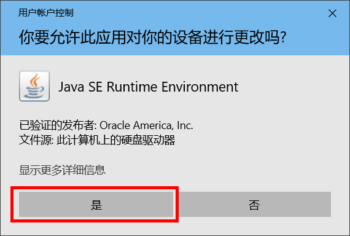

按照界面上的提示一步步操作，直到提示完成安装。

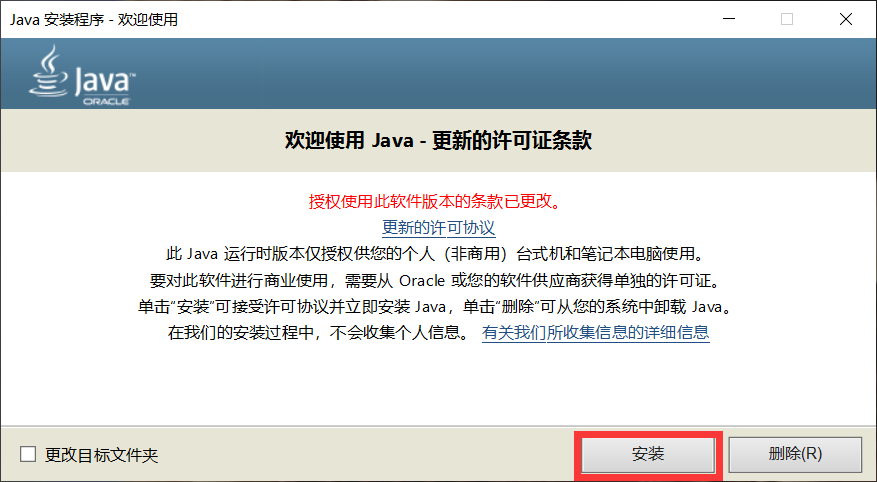

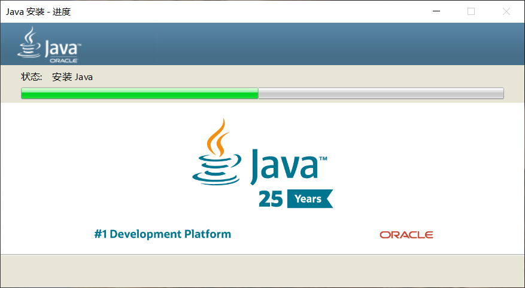

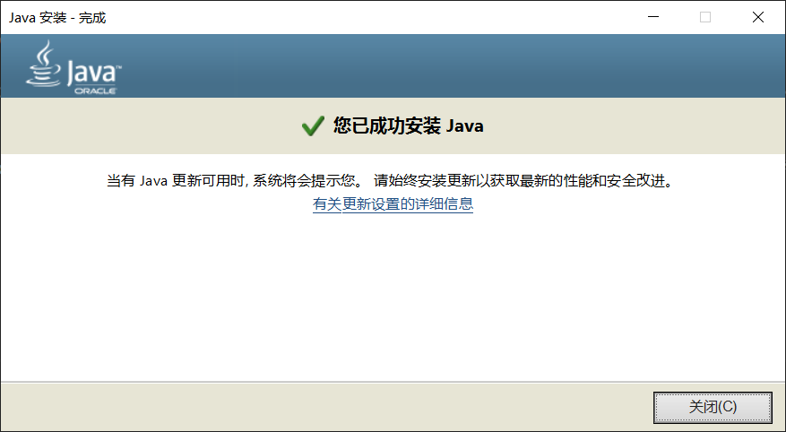

+ **Mac OS平台玩家**

Mac OS平台安装 `.dmg` 格式文件的步骤和Windows用户类似，这里不作赘述。

+ **~~Linux平台玩家~~**

~~Linux用户不会装JDK？wget指令也不会用？那你只是纯粹拿Linux装逼的吗？~~

> [!tip]
> 一般来说，系统在安装Java时会自动配置好 *Java* 环境。如果玩家在安装好Java并准备进行游戏时却提示找不到Java，请参考[这里](./reference/javaconfig.md)。

## 下载启动器

+ **正版启动器**

对于正版用户，最稳妥的选择是使用[正版启动器](https://www.minecraft.net/zh-hans/download)，它简洁美观，只是在下载时可能网速不是很令人满意。

> [!tip]
> 如果只想使用正版启动器，但同时又想体验丰富的社区Mod，请移步参考[这里](https://www.bilibili.com/read/cv6120888/)。

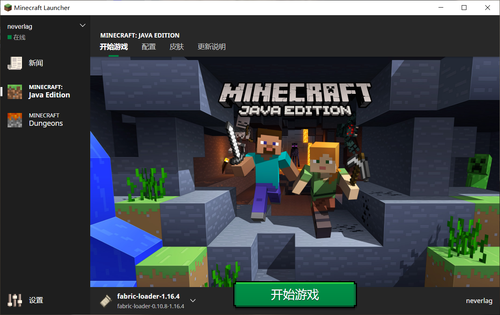

使用正版启动器，可以享受到官方自带的皮肤系统，并且能获得正规、及时的官方消息通知。

+ **第三方启动器**

>我们认为游玩正版游戏是值得鼓励的，但也不会强迫任何人必须购买正版Minecraft。如果你并非正版玩家，但同时能够在这个游戏中享受到许多乐趣，那么可以考虑在适当的时机补个票。

对于非正版玩家，或是不习惯使用正版启动器的玩家，可以考虑使用第三方开发者提供的第三方启动器。

在网络上，第三方启动器有很多途径可以获取到，不过既然加入了我们的QQ群，那自然就选择在群文件 `客户端整合包` 中下载已经做好基本配置的整合包。

> [!tip]
> Mac以及Linux用户请猛戳[此处](./reference/linuxmac.md)了解如何下载使用第三方启动器。

> [!attention]
> 请不要下载和使用来源不明的第三方启动器！！！这可能会危害你的账号和计算机安全！！！

## 设置启动器

以`能力整合[1.17.1]`整合包为例，玩家在下载该整合包之后对其解压，可以得到下图所示的文件：

双击 `HMCL-3.3.188.exe` 文件启动HMCL启动器（如果想尝鲜的话，也可以使用图中的`PLC2`启动器）。

对于正版玩家，请选择下图所示的`Mojang账号`或`微软登录`模式。其中，已按Mojang官方要求在2021年完成账号迁移的玩家，**务必使用`微软账号`模式登录**。

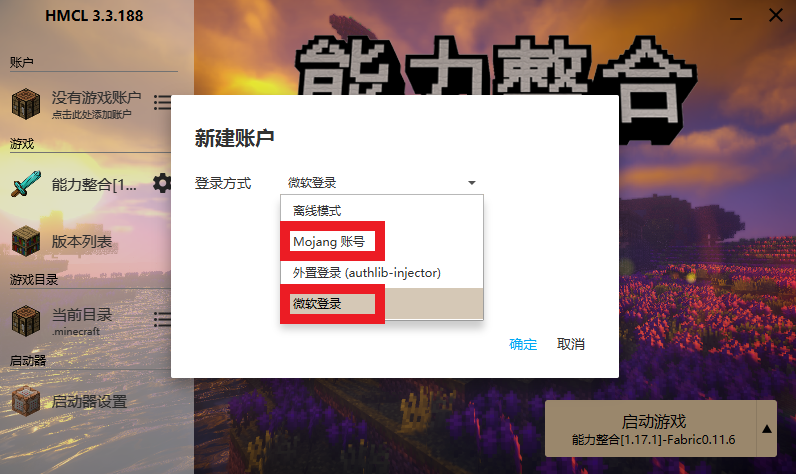

对于非正版玩家，应该选用`离线模式`进行登录和游玩。输入你喜欢的用户名（注意必须是英文字母或者数字，可以大小写与下划线，不能使用中文），然后点击**确定** 。

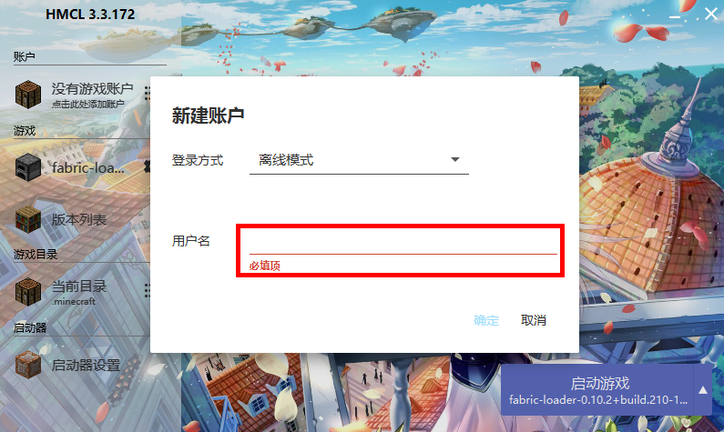

最后 **启动游戏** 。

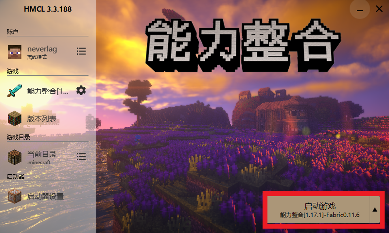

## 加入服务器

游戏启动后，选择“多人游戏”，进入服务器列表。

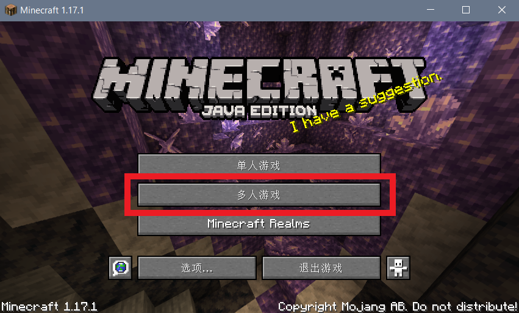

在服务器列表中，点击“加入服务器”，就可以开始和其他人一起愉快地玩耍了。

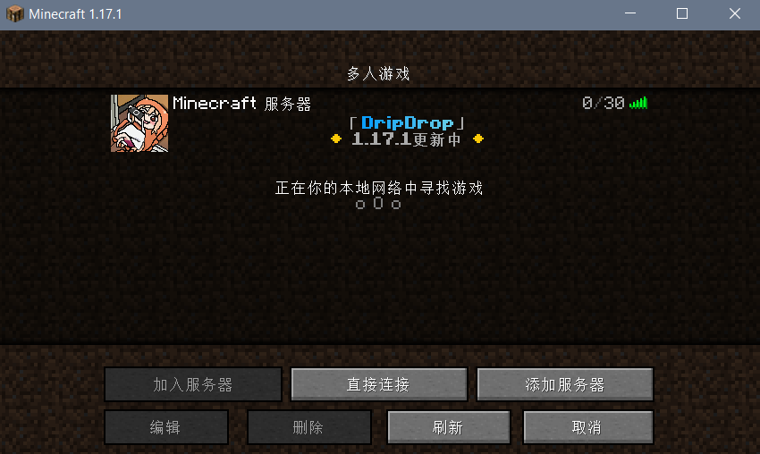