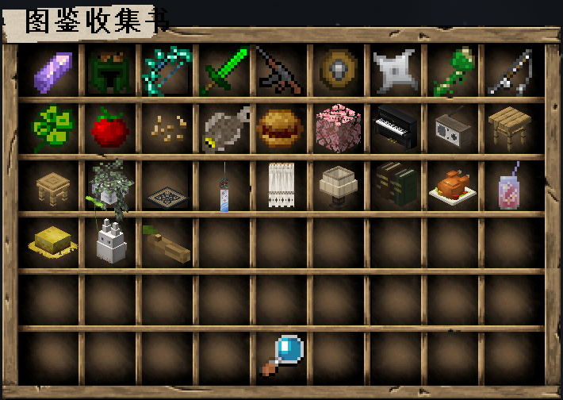
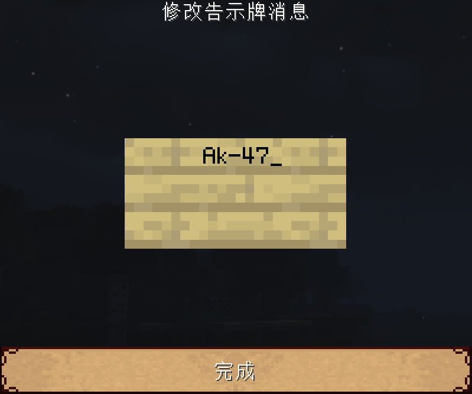
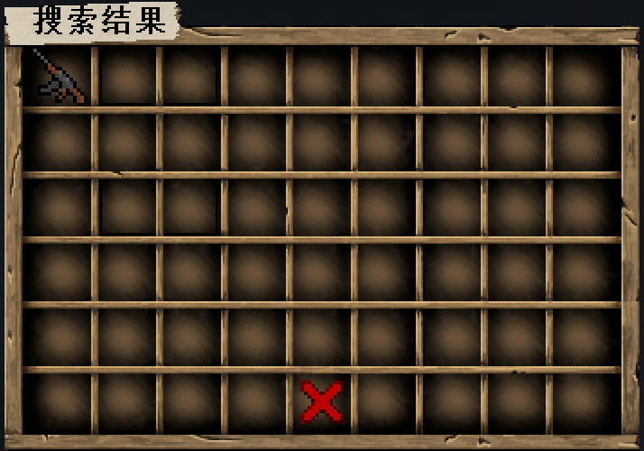
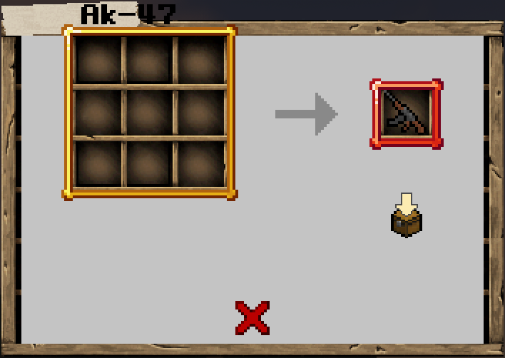
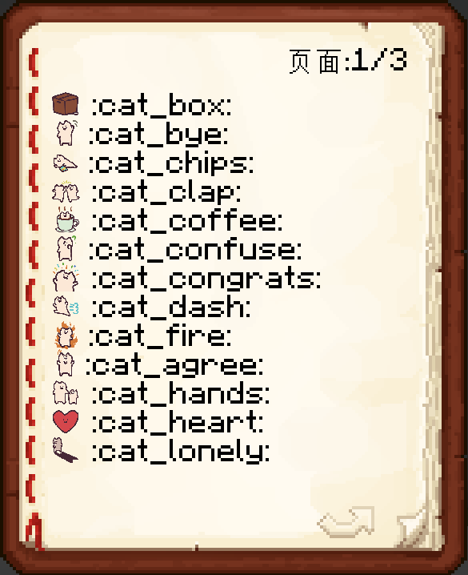

## 拓展物品百科全书

> [!note]
> 拓展物品和原版物品最大的区别就是，拓展物品会有很多行lore（即描述）。

1. **用指令`/ia`打开图鉴收集书**

## 查找拓展物品的合成表

1. **你可以点击按钮： `放大镜`  来快速搜索物品**

    在`告示牌`中输入你要查找的物品, 然后点击**完成**即可搜索。

    

    

2. **手持拓展物品输入`/iarecipe`快速获得当前物品的合成表。你可以在图鉴里随意地翻翻点点，查看各个物品所需的合成材料。**

## emoji表情

1. **打开emoji表情的书** `/iaemoji`

2. **你可以在聊天和称号中使用emoji表情。比如在聊天框里输入 `:cat_bye:` 来打出猫猫挥手告别的表情**

> [!tip]
> 你还可以在聊天框里输入指令`/e`+空格，来选择和发送表情包！

3. **你还可以在铁砧用表情包给你的物品命名，比如命名为 `&f:mc_apple:` ，物品的名字就会变成一个苹果（如果不加&f，就会是一个斜着的苹果）**

## 为服务器添加物品

+ 服务器内拓展物品一般都是采用**16×16像素**的png图片。

+ 制作模型使用**Blockbench**。

+ 你可以在QQ群 `286338133` 里上传你绘制的**物品.png**或者**模型.json**。

+ 如果需要帮忙制作简易人物手办，请上传人物的**皮肤.png**。

## 常问的问题

1. **拓展物品里的翅膀能飞吗**

    实际上，他们只是一个羽毛并不是鞘翅，所以并不能装着翅膀飞。（或许今后会给翅膀附加上一些特效与指令？）

2. **神秘矿石为什么那么少?真的有吗？**

    确实是有的，只不过神秘矿石需要在1-6层才生成，生成条件似乎是需要有岩浆湖什么的?

    实际上，神秘系列的武器装备也并不是现在的最强了，我并不建议你花费大量时间去肝。

3. **服主赠送的玩具是什么意思?**

    标注了获得途径为服主赠送的，指你可以在服主neverlag或者Dell_G3，或者建筑师momo0_0在场时，

    你可以跟他们说你很喜欢某个玩具，并让他们赠送你一个。

    当然愿不愿意送你就两说了（比如我们还不熟）。