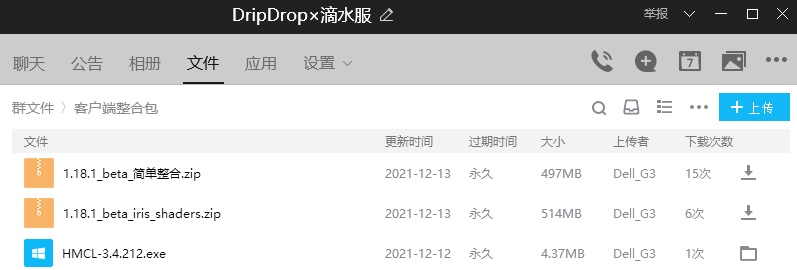
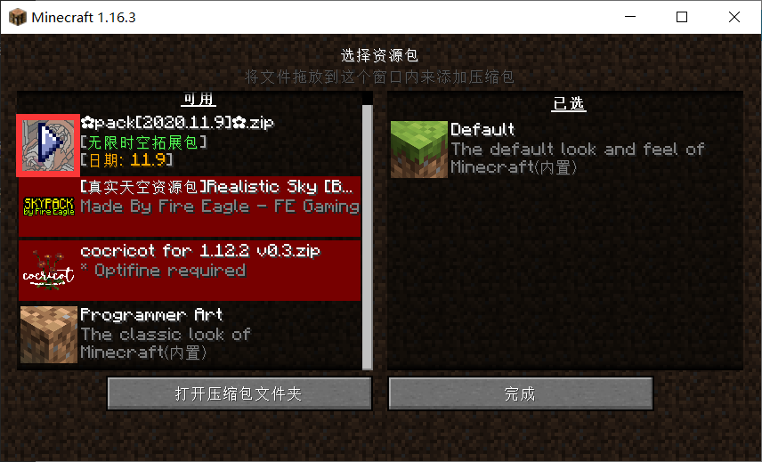
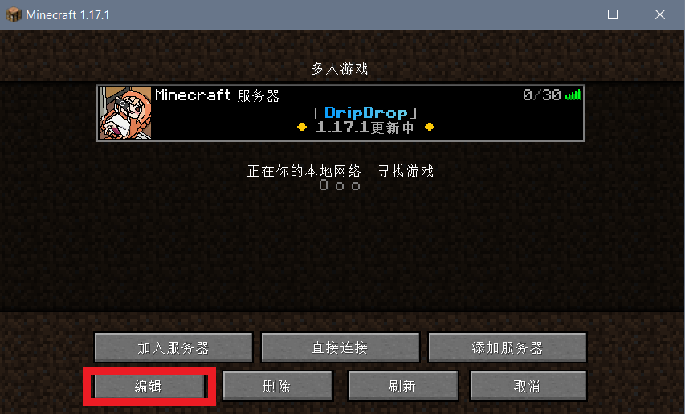
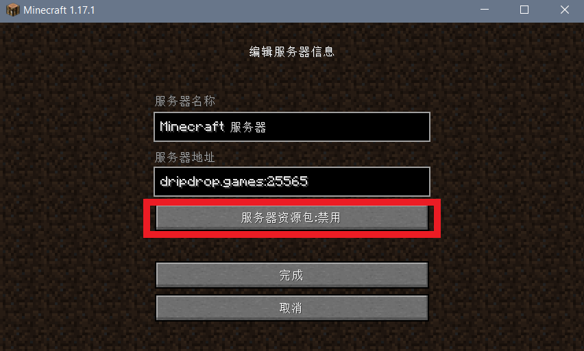

## 有整合包吗

请加QQ群 `286338133`  ，从群文件里的`客户端整合包`中下载。

## 材质包怎么安装

如果你在游戏中，请按`ESC`进入**选项... → 资源包... → 打开压缩包文件夹**。

然后将下载来的材质包直接拖入这个文件夹中（不需要解压）。

最后点击红色框框里的箭头，让材质包进入右侧的 <u>**已选**</u> 当中，最后点击 **完成** 即可加载材质包。

## 每次加入服务器都加载材质包好麻烦

你可以在 **多人游戏** 这个界面选中我们服务器后，点击 **编辑** ；

然后**点击服务器资源包设置为禁用**；

这样你就可以屏蔽掉服务器推送给你的材质包（但是游戏体验可能会有所下降）。

## 正版用户不显示皮肤

在服务器里进行[正版验证](firstjoin?id=正版验证) ，之后退出服务器重进一次即可。

## 正版验证后无法登录

+ 如果你是非正版玩家，请加QQ群`286338133` 联系 **管理员neverlag** 替你取消验证，并且记得下次别再瞎搞了；

+ 如果你是正版玩家，请检查启动器是否已使用正版登录模式；

+ 网络问题可能导致验证失败，请尝试重启客户端（~~你可能是正版游戏的受害者~~）。

## “你不允许再为你的IP在服务器注册更多用户了!”

我们服务器限制了一个IP只能注册一个账号，以避免有玩家注册大量小号刷物品。

如果你和你的朋友碰巧出现IP一样的情况，请加QQ群`286338133` 联系 **管理员neverlag** 帮你注册账号。

## “你的用户名包含非法字母，用户名里允许的字母...”

请 **不要使用中文** 作为游戏id，因为 *Java* 版不允许使用中文字符。

如果你特别想使用中文id，你可以在加入服务器后设置nickname（昵称）。

## 我搜索不到服务器怎么办？

> [!note]
> 这里的搜索不到服务器是指没有加载出服务器图标和服务器的Motd的情况

服务器无法连接通常有2种可能：

+ **玩家自己的网络问题**
    
    可以通过尝试浏览网页等方式进行排查，若这些方式有异常，则证明网络存在问题；
    
    若连接其他服务器异常，则可能是玩家自己电脑的防火墙拦截了客户端的网络连接，具体解决方案建议寻求搜索引擎帮助。

+ **服务器处在维护、重启等未开放的状态**
    
    这种情况通常会有通知，注意群里的聊天信息和公告等。待维护、重启等工作结束后，服务器就会恢复正常连接。

## 我的启动器为什么会崩溃？

+ **如果是安装服务器材质包时崩溃**

    请往上翻，查看[每次加入服务器都加载材质包好麻烦](joinproblem?id=每次加入服务器都加载材质包好麻烦)

+ **如果未进入服务器前就崩溃**

    通常引起这种崩溃的原因有Java环境异常、mod缺失或冲突等，请根据崩溃日志通过搜索引擎自行排查，或在群内寻找帮助。

## 我进不了游戏怎么办？

如果不是客户端崩溃导致玩家无法进入游戏，常见的问题有以下几种：

* 第一种是提示“Out Of Memory”（内存溢出），这种情况通常是玩家没有给游戏分配足够的内存（在64位电脑，你为启动器分配的最大内存应该达到2 GB 或 2048 MB）。

* 第二种是提示“connection”有异常，这种情况通常是网络连接有问题，建议玩家先排查自己的网络是否异常。

* 第三种是提示“同一账号已经登录”，这种情况可能是服务器的玩家登录状态数据还没来得及更新，建议玩家稍等一段时间再尝试重新进入。

* 第四种是提示“身份验证失败”或“身份验证服务器维护中”，常见于正版玩家，多是 *Mojang* 的验证服务器连接有异常，建议玩家等一段时间再重新进入，或是使用科学上网工具以绕开China's Great Fire Wall的抽风式干扰。

* 第五种是提示“已被列入黑名单”，建议玩家自行排查是否有违规行为被检测到，并联系**管理员neverlag**解决。

* 第六种是提示“Unknown Host”（未知主机），建议玩家检查输入的服务器地址是否正确，有没有使用不该使用的**全角字符**（比如中文冒号`：`，类似`ＡＢＣ１２３`这类间距特别大的字母和数字）输入。

* 第七种是提示“无效会话”，这种情况游戏本身会提示建议玩家重启游戏尝试再次登录。

其他情形建议玩家截图或上传错误信息到群里，管理员和其他可能遇到并解决过类似问题的小伙伴将尝试在线解决。

## 服务器支持基岩版玩家登入吗？

目前本服务器仅支持 *Java* 版玩家登入。虽然现在市面上有[Geyser（间歇泉）](https://geysermc.org/)这样的互通插件，但是开发者自己也承认互通插件本质上就是进行了协议转换，而基岩版与Java版之间的差异远远不止于此（**尤其是一些数据结构**）。所以就目前来看，除非基岩版和Java版能够做到“唯一的差异就是开发语言”，否则互通插件使用起来有很多限制。强行互通带来的收益不见得会多于运营单一类型的服务器。由于存在这些目前还不能解决的差异问题，两种版本的玩家同处一个服务器时，将不得不相互妥协，因此很有可能无法完整享受到各自版本带来的全部体验。

> [!note]
> Geyser插件的开发者在其[GitHub项目上的部分Wiki原文](https://github.com/GeyserMC/Geyser/wiki/Current-Limitations)如下：
>
>"With Geyser being a protocol translator between two different games with two different codebases, 
>there are a handful of limitations that Geyser is unfortunately unable to handle. 
>Despite Minecraft Bedrock and Java being quite close in comparison, there are some vast differences in many areas."
>
>翻译：“Geyser作为一个基于两种不同代码所开发的**两种不同游戏**之间的协议转换器，还有一大堆限制没法解决。尽管基岩版和Java版相比有很多相近之处，但是在别的地方也同样存在着巨大的差异。”
>
> 注：互通插件的开发者认为基岩版和Java版之间的差异已经大到足以认定为两种游戏。

## 我忘记了账号登录密码怎么办？

>[!attention]
>切勿轻信和使用任何由未知第三方提供的账号密码找回服务！

**正版玩家请务必使用官方提供的正式渠道** 找回账号密码，非正版玩家则联系服主处理。

