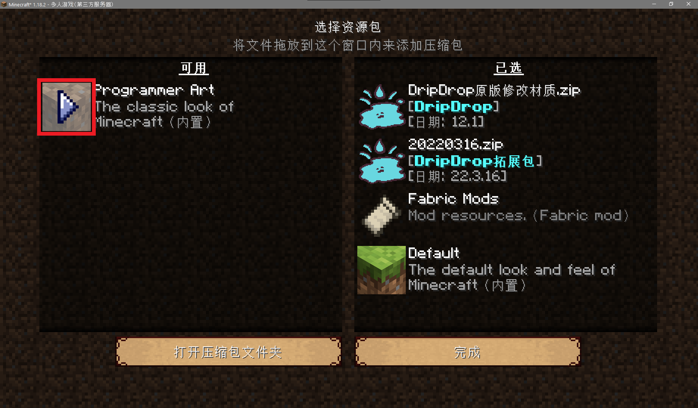

## 游玩本服有什么规定吗

有的。

**不欢迎以下人（shǎ）员（bī）：** 

+ 烧杀抢掠，以搞破坏为乐的`熊孩子`；
+ 飞天透视，作弊行为恶劣的`神仙`；
+ 脾气暴躁，随时随地对他人口吐芬芳的`祖安人`；
+ 只会复读，到处传播垃圾信息的`大喇叭`；
+ 一无所知，却认为别人应当无条件帮助自己的`爷新`。

**不适合以下玩家：**

+ 搞大型红石（指规模巨大且长期运作，严重消耗服务器资源和降低其他玩家的游戏体验）的玩家；
+ 重度RPG玩家；
+ 热衷肝/刷并以此为唯一游戏目标的玩家。

**绝对不能做的事：**

1. 恶意攻击伤害其他玩家；
2. 开透视，飞天等外挂；
3. 破坏其他玩家的建筑；
4. 盗取其他玩家的财产；
5. 利用BUG刷物品；
6. 恶意卡服影响其他玩家游戏。

**不应该做的事：**

1. 宣传其他服务器；
2. 和其他玩家发生争吵；
3. 发表引起争议的不当言论；
4. 在一个区块大量堆积实体。

>[!tip]
>以下为典型的熊孩子案例（挂人一时爽，一直挂人一直爽）：

|   玩家名    |                       事由                       |            处理措施             |
| :---------: | :----------------------------------------------: | :-----------------------------: |
|    nmsl     | 恶意拆毁其他玩家没有圈领地的家，还创小号进来骂人 | 永久封禁 |
|   whx233    |         不仅拆别人家，还把别人的箱子锁了         | 永久封禁 |
| FuFusuperBa |          明目张胆在服主面前开启飞天外挂          | 永久封禁 |
|  SirCakeX   |     开小号偷东西搞破坏，大号转移物资试图洗白     | 永久封禁 |
|   _Hzxlzz   |      大量购买火药制作TNT炸别人家还试图隐瞒       | 永久封禁 |
|   Gaveme    |       偷老玩家的纪念物品，恶意点火破坏建筑       | 永久封禁 |
|   ian3451   |  通过发表不当涉政言论的方式，妨碍服务器正常运营  | 永久封禁 |
|Diving7|蓄意破坏其他玩家领地周围地理环境，拒绝道歉和恢复|永久封禁|

## 有整合包吗

请加QQ群 `286338133`  ，向群里的小伙伴询问下载最新整合包。

## 材质包/资源包怎么安装

服务器专用材质包可以从群文件目录`材质包（resourcePack）`里下载“DripDrop原版修改材质”，如下图所示。

服务器拓展物品资源包可以从群文件目录`✿服务器资源包`里下载最新日期发布的资源包。

如果你在游戏中，请按`ESC`进入**选项... → 资源包... → 打开压缩包文件夹**。

然后将下载来的材质包直接拖入这个文件夹中（不需要解压）。

最后点击红色框框里的箭头，让材质包进入右侧的 <u>**已选**</u> 当中，最后点击 **完成** 即可加载材质包。

## 我搜索不到服务器怎么办？

> [!note]
> 这里的搜索不到服务器是指没有加载出服务器图标和服务器的Motd的情况

服务器无法连接通常有2种可能：

+ **玩家自己的网络问题**
    
    可以通过尝试浏览网页等方式进行排查，若这些方式有异常，则证明网络存在问题；
    
    若连接其他服务器异常，则可能是玩家自己电脑的防火墙拦截了客户端的网络连接，具体解决方案建议寻求搜索引擎帮助。

+ **服务器处在维护、重启等未开放的状态**
    
    这种情况通常会有通知，注意群里的聊天信息和公告等。待维护、重启等工作结束后，服务器就会恢复正常连接。

## 我的启动器为什么会崩溃？

+ **如果是使用服务器材质包引起崩溃**

    请暂时停用材质包，然后将问题反馈给服主`neverlag`以便及时处理。

+ **如果未进入服务器前就崩溃**

    通常引起这种崩溃的原因有Java环境异常（比如版本不适合）、mod缺失、冲突或版本不匹配等，请根据崩溃日志通过搜索引擎自行排查，或在群内寻找帮助。

## 我进不了游戏怎么办？

如果不是客户端崩溃导致玩家无法进入游戏，常见的问题有以下几种：

* 第一种是提示“Out Of Memory”（内存溢出），这种情况通常是玩家没有给游戏分配足够的内存（在64位电脑，你为启动器分配的最大内存应该至少达到2 GB 或 2048 MB）。

* 第二种是提示连接有异常，这种情况通常是网络连接有问题，建议玩家先排查自己的网络是否异常。

* 第三种是提示“身份验证失败”或“身份验证服务器维护中”，表示玩家与 *Mojang* 的验证服务器连接有异常，原因主要包括玩家网络波动、官方服务器宕机或中国国家防火墙干扰。建议玩家尝试多登录几次，或是等官方修复问题后再重新进入，又或是使用加速器等科学上网工具。

* 第四种是提示“Unknown Host”（未知主机），建议玩家检查输入的服务器地址是否正确，有没有使用不该使用的**全角字符**（比如中文冒号`：`，类似`ＡＢＣ１２３`这类间距特别大的字母和数字）输入。

其他情形建议玩家截图或上传错误信息到群里，管理员和其他可能遇到并解决过类似问题的小伙伴将尝试在线解决。

## 服务器支持基岩版玩家登入吗？

目前本服务器仅支持 *Java* 版玩家登入。虽然现在市面上有[Geyser（间歇泉）](https://geysermc.org/)这样的互通插件，但是开发者自己也承认互通插件本质上就是进行了协议转换，而基岩版与Java版之间的差异远远不止于此（**尤其是一些数据结构**）。所以就目前来看，除非基岩版和Java版能够做到“唯一的差异就是开发语言”，否则互通插件使用起来有很多限制。强行互通带来的收益不见得会多于运营单一类型的服务器。由于存在这些目前还不能解决的差异问题，两种版本的玩家同处一个服务器时，将不得不相互妥协，因此很有可能无法完整享受到各自版本带来的全部体验。

> [!note]
> Geyser插件的开发者在其[GitHub项目上的部分Wiki原文](https://github.com/GeyserMC/Geyser/wiki/Current-Limitations)如下：
>
>"With Geyser being a protocol translator between two different games with two different codebases, 
>there are a handful of limitations that Geyser is unfortunately unable to handle. 
>Despite Minecraft Bedrock and Java being quite close in comparison, there are some vast differences in many areas."
>
>翻译：“Geyser作为一个基于两种不同代码所开发的**两种不同游戏**之间的协议转换器，还有一大堆限制没法解决。尽管基岩版和Java版相比有很多相近之处，但是在别的地方也同样存在着巨大的差异。”
>
> 注：互通插件的开发者认为基岩版和Java版之间的差异已经大到足以认定为两种游戏。

## 我忘记了账号登录密码怎么办？

>[!attention]
>切勿轻信和使用任何由未知第三方提供的账号密码找回服务！

我们无法提供任何与此相关的技术支持，**请正版玩家务必使用官方提供的正式渠道**找回账号密码。

