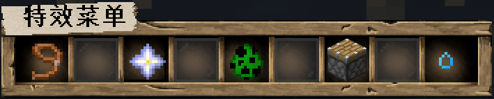
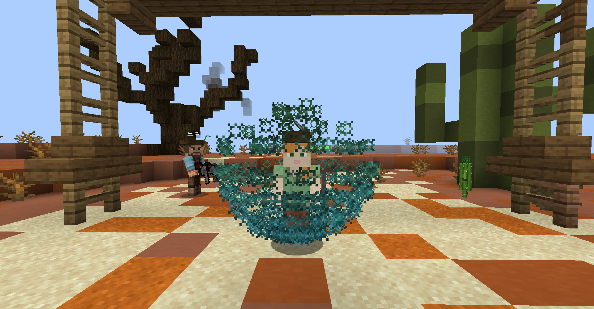
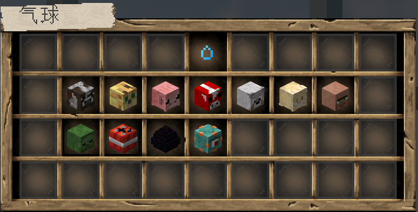
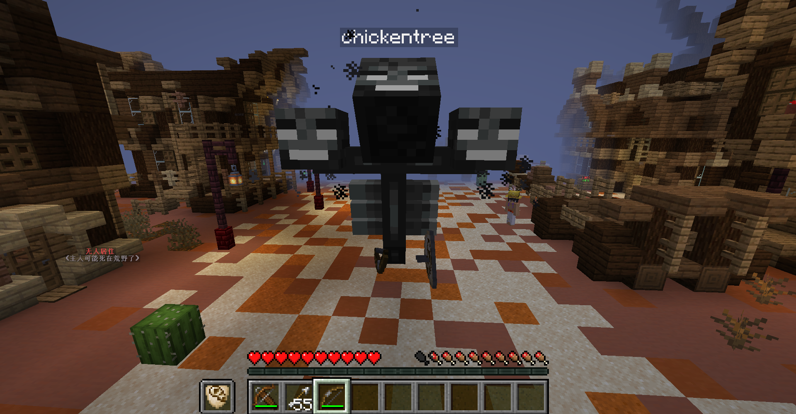
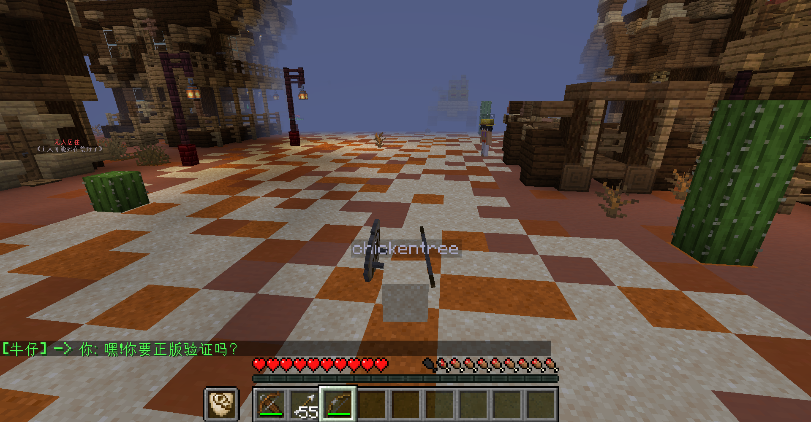
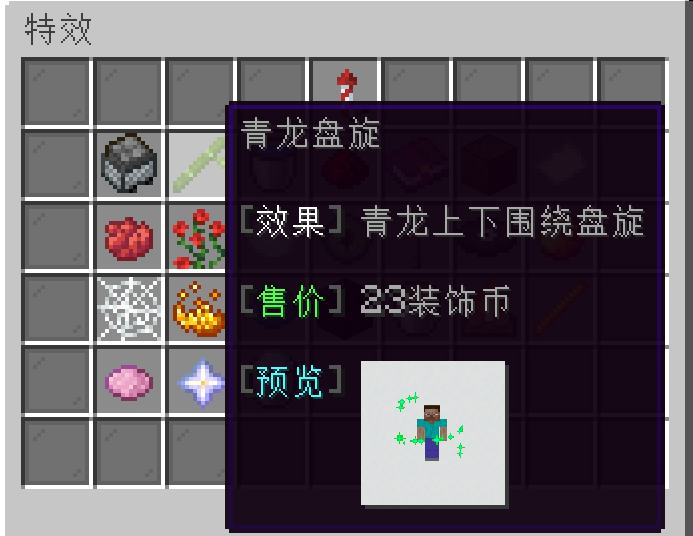
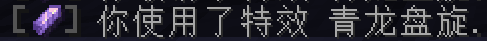
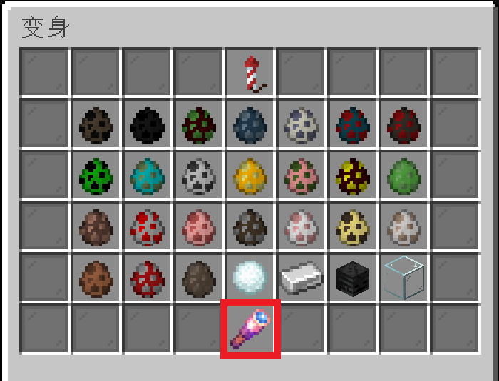

> [!warning]
> 特效插件为Procosmetics，虽然有很多内置的特效，但完全无法自定义，所以没法增加或修改特效。
> 该插件有许多Bug，而且插件作者的态度极其敷衍和随便，我只能把有Bug的特效暂时删除了。

## 特效菜单

输入指令 `/cos` 打开特效菜单：

+ 将鼠标放在  `向日葵` 上可以查看你的 **装饰币** 数量；

+ 点击  `花盆` 可以**卸下**所有的装饰特效。

## 粒子特效 

> 粒子特效是时刻触发的，静止时往往是构成粒子图案，立体形状，运动时会在身后留下一道粒子轨迹的特效。

例如 `保护盾` 在玩家**静止**时，会有一个蓝色的粒子形成盾的效果：

而在**移动的时候**，会在人物后面留下一道蓝色的轨迹：

## 弓箭特效

> 弓箭特效是在用弓或者弩射出箭时，给箭附加的特效，箭移动中有轨迹特效，击中触发击中特效。

## 死亡特效

> 死亡特效是在玩家死亡时触发的特效，但本人几乎观察不到，不推荐购买。

## 气球特效

> 气球特效是让玩家右手牵着一个气球，当然你实际上还是可以用右手拿东西。

## 变身特效

> 变身特效是让玩家变成一个怪物或者方块，有的怪物还具有特别的技能。

变身的原理是让玩家隐形（穿的盔甲并不隐形），在玩家的位置生成一个实体，模拟变身的效果。

例如变成 `凋零` 就可以像创造模式一样**飞行**：

要变成 `方块`，可以右键点击沙子变成沙子，点击泥土变成泥土，**可以任意转变**：

## 坐骑特效

> 坐骑特效是召唤一个坐骑，除了 `死灵战马` ，现有坐骑都可以**飞天**。

> [!warning]
> 有的玩家乘坐`末影龙` 可能会非常卡顿。

你甚至可以召唤 `末影龙` 用鼠标的视线来操纵末影龙飞行的方向：

## 装饰币

> [!note]
> 装饰币是用来购买特效的货币，独立于硬币，玩家之间无法交易。

1. **每日签到领取2枚装饰币（购买了 `用爱发电机` 的玩家在 `发电`期间可以双倍领取 ）；**

2. **你可以通过氪金用RMB购买装饰币，比例为1:5；**

3. **你可以通过顶帖每次获得5枚装饰币；**

4. **你可以参加服务器举办的活动（不定期）获得装饰币。**

## 选用特效

+ 你需要点击想要使用的特效：

    

+ 选用后系统会提示已装备使用该特效：

    

## 常见问题

1. **变身特效为什么我看不见变身？**

    在变身特效的菜单里面，点击红框处的 `切换自我观察模式` ，再利用`F5`切换视角，即可看见变身的样子：

    