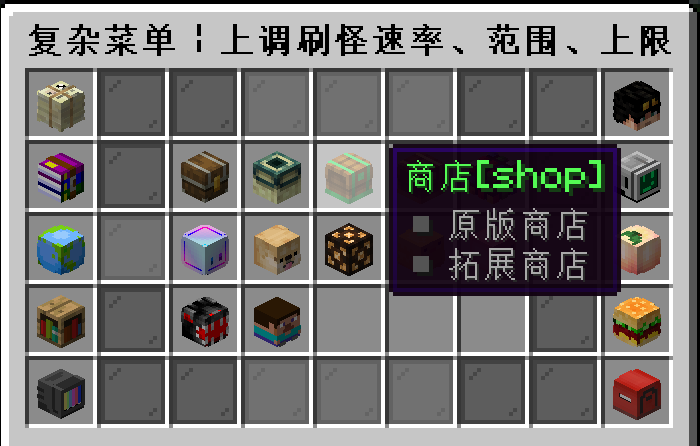
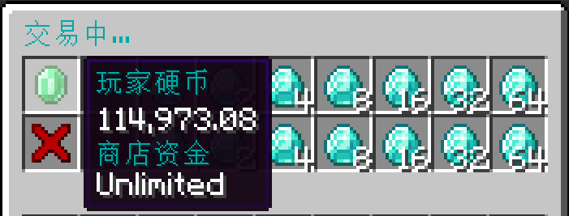
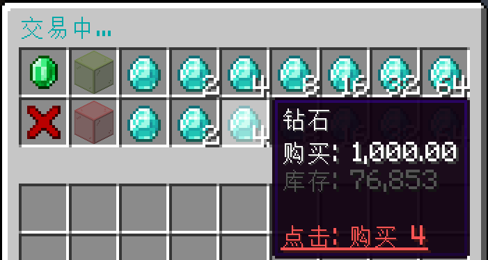
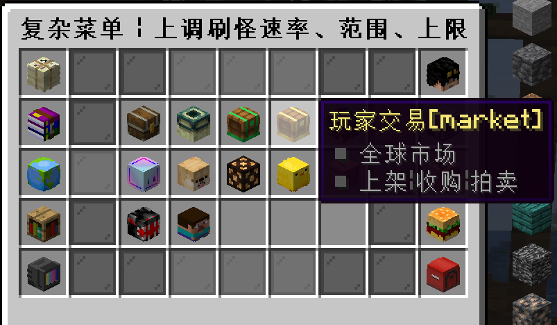
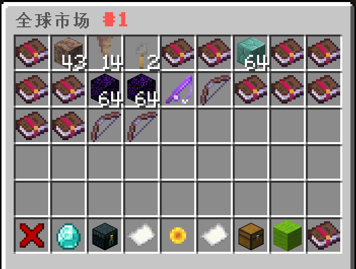
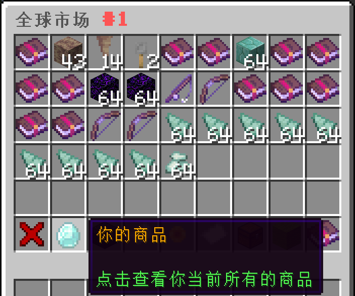

## 怎么赚钱，去哪赚钱？

> [!note]
> DripDrop的游戏货币名字为 `硬币` ，用于圈地，玩家之间交易，购买系统物品

1. **一般玩家是挖矿卖矿石**

    输入指令 `/rt` 随机传送，找个地方开始挖矿。

    接着输入指令 `/menu` 或 `/cd` 打开系统菜单，找到下图的商店入口。

    

    进入商店后，选择左侧普通商店的矿物商店入口，如下图所示。

    

    在矿物列表界面选择其中一种可交易的矿物（本例中为钻石），点击进入贸易市场界面。

    

    

    在上面的交易界面里，将鼠标移至绿宝石上可以显示当前玩家的硬币余额和商店总资金数量:
    
    
    
    左键点击绿玻璃方块，可以切换至出售模式，玩家可以选择右边某个给定的商品数量进行出售以换取硬币:
    
    

    左键点击红玻璃方块，可切换至购买模式，玩家可以选择右边某个给定的商品数量进行购买:

    

2. **也可以同其他玩家自由交易**

   玩家可以进入下图所示自由市场，自由买卖任何由玩家上架的商品：

   
   

   如果玩家有物品需要售出，首先要**右手持有该物品**，接着输入指令`/ca sell <总售价> <售出数量>`并发送执行，即可将物品上架到自由市场中。

   >[!note]
   >注意，在`/ca sell <总售价> <售出数量>`指令中，售出数量**最大不能超过玩家右手持有的物品实际数量**，总售价也是代表这些数量的物品打包出售的价格，数值不能低于0.1。此外，如果一个（组）物品没有被拿在右手上，那么出售指令是不会对其生效的。

   如果玩家想要对已上架的商品进行重新定价，那么可以按照下图进到相应的菜单界面，选择要重新定价的商品：

   
   

   **右键**点击指定商品，系统就会在聊天栏里弹出类似下图的提示，按指示修改定价即可：

   

## 这个服务器怎么玩？

我不知道问出这个问题的人是希望我回答什么，这就是一个普通的生存服，加了一些拓展物品罢了。不过我可以给出一些建议：

1. **如果你是一个喜欢自行摸索的玩家**

    你可以和在其他服一样四处逛逛，然后收集，然后造家，就和普通的生存服一样没有任何差别。
    
    只不过偶尔你会在钓鱼的时候会钓上来一只`青蛙`，一只`水母`，甚至一个 `鲨鱼帽`；

    偶尔你会在打草的时候掉落了 `水稻种子`，`四叶草`，在杀僵尸的时候掉了一个 `僵尸手办`；

    这个时候你可以看看物品的描述，输入 `/iarecipe` 看看它的配方，然后放到仓库里面收藏起来。

    或者看见邻居家里造了一个 `木椅子`或者 `风铃`，你也想造，于是输入 `/ia` 在`拓展物品百科全书`里找到配方自己也造一个。

2. **如果你是一个喜欢读Wiki的玩家**

    我觉得你可以大体看看有什么新玩意，然后还是该干嘛干嘛；

    你大概会一页一页地翻自己能合成的物品，然后把它们造出来放在家里，这样就已经是很出色的玩家了；
    
    当然，你可能认真地读了Wiki，知道了各种指令、Boss的位置与打法等等，最后变成了我们服的大佬。

## 为什么服务器人那么少？

人少并不代表服务器质量不好，实际上会问这个问题的玩家都认为我们服务器质量还行，我很感谢能问这个问题的玩家。

1. **服务器太多了**

    截止到我写Wiki的时候，已经通过MCBBS审核的服务器有1806个，不通过MCBBS宣传的服务器还会更多。

    有太多对服务器不了解的人，在淘宝上买个面板服（通常还是垃圾配置）采用一键方式草草开服。

    这样的结果就是服务器数量太多，导致玩家都被分散开了，平均下来每个服可能也没有多少人。

2. **很多玩家并不知道服务器的好坏**

    有的服务器哪怕光看宣传贴就无法感受到诚意，两三张随意的截图，配上稀稀拉拉的文字。

    甚至服务器可能是用服务端整合包直接开起来的，连主城地图都不换。

    仅仅是因为刚开荒，就能吸引许多玩家过去玩。

    还有那么多的快餐骗钱服，也能吸引许许多多的玩家去充值。

    我自己个人很喜欢的几个服务器（`Sotap`、`极东域`以及`奔兔`等）人都很少。

    但这几个服的质量和游戏深度都是挺好的，或许玩家也没有耐心去玩。
    
    不得不承认的是，**有什么样的玩家就会塑造什么样的游戏环境和市场**。
    
    只要有愿意吃💩的玩家存在，自然就会有提供💩的游戏运营者，而且主动吃/喂💩尤为可悲。

3. **我们服务器自身原因**

    作为一个养老生存建筑服，没有足够的配置去引入大型RPG等比较能吸引玩家的玩法。

    服务器宣传也完全不够，一天或许只顶一次贴，根本没什么人知道我们服务器。

    而且那些升级和肝的插件（比如MCMMO和通行证）我也拒绝加入，玩家如果自己没有目标很容易无所事事。

    我很反感那些给予玩家大量即时反馈的插件，让玩家过几分钟就获得升级、获得满足，Minecraft不应沦落成国产页游的模样。

    这是出于对人的性格塑造考虑的，玩家没有必要为了这个服务器里的一些虚幻的数值提升而浪费大量宝贵时间。

    > 现实社会已经内卷到令人窒息的地步，在一个虚拟世界里还要继续鼓励“与人斗，其乐无穷”的做法毫无意义。

4. **恶性循环**

    人少的服务器会让不了解的玩家觉得这个服务器很差，从而不愿意玩，进而人数越发地少。有些东西我们愿意做出改变，但是有些东西我们确实无力改变。

## 这个服是几周目，会不会删档?

当前为周目4，通常每更新一个大版本就会换一个周目。关于删档问题，以下为可能会删档的因素：

+  大版本更新后的体验测试阶段，因日活跃玩家和游戏内容数量通常不会达标，因此基本不会保留该阶段的服务器存档；

+  发生重大事故，服务器数据完全损坏且无法采取任何方式恢复（例如物理主机遭遇核爆，或是服务商跑路删数据）；

+  依据有关法律、法院裁决或行政命令，个人被禁止在中国大陆境内公开建立运营Minecraft游戏服务器，以及提供相关服务；

+  长期没有任何一个玩家玩这个服务器（彻底凉了，不止删档，可能再也不开了）。

## 能不能加个XX插件？

> 如果你非要玩某个插件，我的建议是自己开个服或者换个服。

一般来说，我**拒绝**，除非你推荐的插件真的很不错。以下为**直接拒绝**的插件：

+   MCMMO插件等一直提供即时反馈的插件；

+   宝石镶嵌，武器强化，装备鉴定等的RPG浓度很高的插件；

+   Mypet宠物插件（这个插件的AI实在是蠢）；

+   地皮插件（我觉得在一块一块的地皮上造家很蠢）；

+   粘液插件（我们服用Itemsadder就够了）。

## 用什么方式圈领地？

 `木锄头`