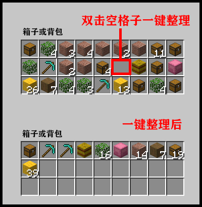
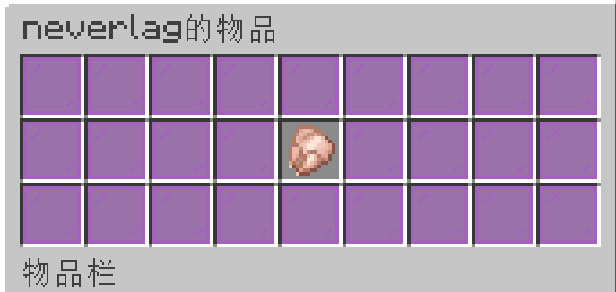
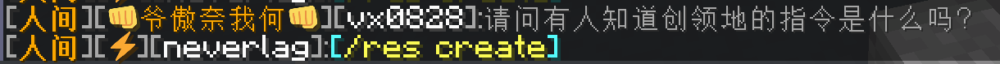
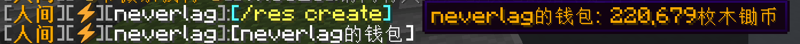
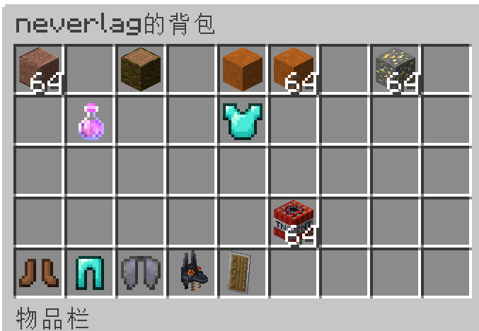

# 一键整理

你可以在箱子或者背包里用鼠标左键双击 `空格子` 进行一键整理。

## 聊天展示

1. **你可以输入 `[item]` 将你手持物品展示到聊天框里**

    

    同时你可以在聊天框里点击在这个 `[生鸡肉 ×1]` 打开页面查看详情。

    

2. **你可以输入 `[/<指令>]` 来告诉其他玩家指令**

    比如你可以输入`[/res create]` 来告诉其他玩家领地的创建指令。

    同时你可以在聊天框里点击这个指令 来直接输入指令。

    

3. **你可以输入 `[money]` 来告诉其他玩家你的钱包**

    同时你可以在聊天框里将鼠标放在钱包上就能查看有多少钱。

    

    你可以在聊天框里点击这个 `[neverlag的钱包]` 则会自动输入转账给该玩家的指令 `/cmi pay neverlag`。

4. **你可以输入 `[inv]` 来展示你的背包**

    

    同时你可以在聊天框里点击在这个 `[neverlag的背包]` 打开页面进行更具体的查看。

    

5. **你可以输入 `[ender]` 来展示你的末影箱**

    

    同时你可以在聊天框里点击在这个 `[neverlag的背包]` 打开页面进行更具体的查看。

    
